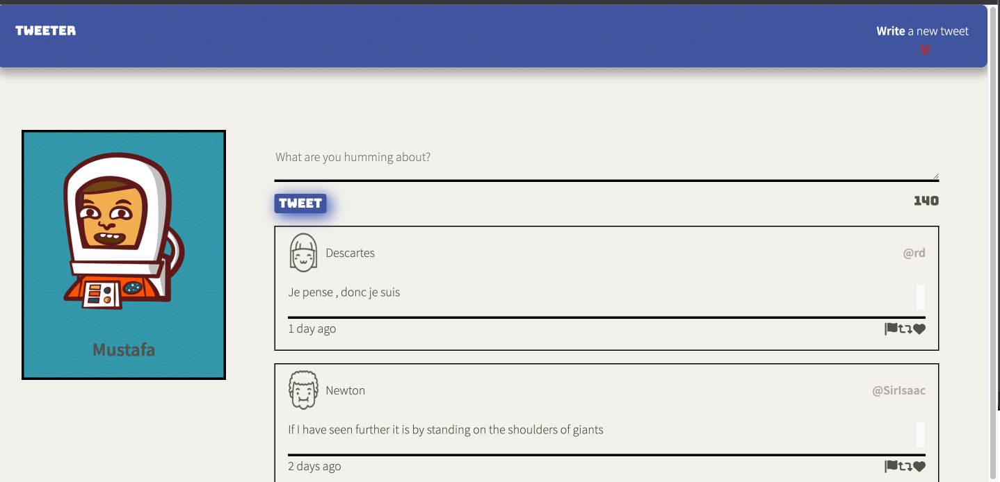

# Tweeter Project

This is a responsive , simple and single-page Twitter clone, built with HTML5, CSS3, JavaScript, jQuery, AJAX, Node and Express.

## Final Product

## Getting Started

- Install dependencies using the npm install command.
- Start the web server using the npm run local command. The app will be served at http://localhost:8080/.
- Go to http://localhost:8080/ in your browser.

## Dependencies

- Express
- Node 5.10.x or above
- chance
- body-parser
